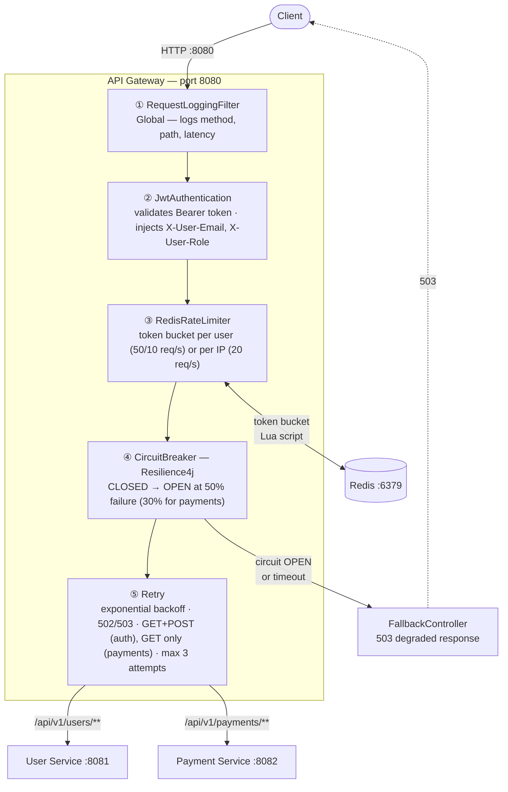
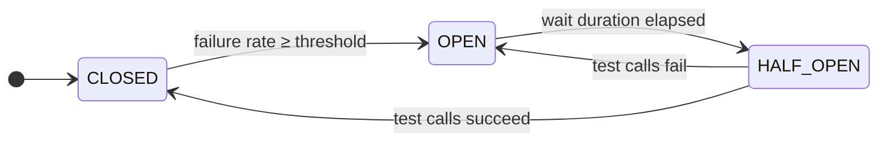

# api-gateway-resilience-demo

A production-grade API Gateway built with Spring Cloud Gateway, implementing Circuit Breaker, Rate Limiting, Retry, and JWT authentication — demonstrating resilience patterns for distributed microservices architectures.

Built as a project to showcase enterprise-grade distributed systems design applicable to fintech, e-commerce, and cloud-native platforms.

[](https://github.com/M-Touiti/api-gateway-resilience-demo/actions/workflows/ci.yml)
[](https://openjdk.org/projects/jdk/21/)
[](https://spring.io/projects/spring-cloud-gateway)
[](LICENSE)

---

## Architecture



---

## Request Flow: End-to-End

Here is exactly what happens when you call `GET /api/v1/users/me` — traced through the actual code and config.

### 1. Route matching (`application.yml`)

Spring Cloud Gateway reads `application.yml` at startup and registers routes. When a request arrives at `:8080`, it matches the first route whose predicate passes:

```yaml
- id: user-service-protected
  uri: ${USER_SERVICE_URL:http://user-service:8081}   # where to forward
  predicates:
    - Path=/api/v1/users/**                            # match condition
  filters:
    - name: JwtAuthentication
    - name: RequestRateLimiter
      args:
        key-resolver: "#{@userKeyResolver}"
    - name: CircuitBreaker
      args:
        name: user-service-cb
        fallbackUri: forward:/fallback/user-service
    - name: Retry
      ...
```

Each `name:` entry maps to a `GatewayFilterFactory` bean. Spring Cloud Gateway resolves `JwtAuthentication` → `JwtAuthenticationGatewayFilterFactory`, `CircuitBreaker` → `SpringCloudCircuitBreakerFilterFactory`, etc.

### 2. Filter chain execution

The gateway combines global filters (always active) and route-specific filters into one ordered chain. Your request passes through each layer:

```
GET /api/v1/users/me  →  localhost:8080
        │
        ▼
RequestLoggingFilter          [GlobalFilter] logs method, path, start time
        │
        ▼
JwtAuthenticationGatewayFilterFactory  [per-route]
        │  reads Authorization: Bearer <token>
        │  calls JwtUtil.isValid() → verifies HMAC-SHA256 signature
        │  extracts email + role from claims
        │  mutates request: adds X-User-Email, X-User-Role, removes Authorization
        │  stores userEmail as exchange attribute (used by rate limiter below)
        │
        ▼
RequestRateLimiterGatewayFilterFactory  [per-route]
        │  calls userKeyResolver → exchange.getAttribute("userEmail") → "user@example.com"
        │  calls RedisRateLimiter.isAllowed("user-service-protected", "user@example.com")
        │    → runs Lua script on Redis atomically
        │    → checks/decrements token bucket stored at key:
        │       request_rate_limiter.{user-service-protected}.{user@example.com}.tokens
        │  if allowed → continue; if not → return 429
        │
        ▼
SpringCloudCircuitBreakerFilterFactory  [per-route]
        │  wraps everything below in: circuitBreaker.run(chain.filter(exchange), fallback)
        │  if circuit is OPEN → calls fallback immediately (no downstream call)
        │  if downstream throws IOException/TimeoutException → calls fallback
        │
        ▼
RetryGatewayFilterFactory  [per-route]
        │  wraps the HTTP call in retryWhen()
        │  retries up to 3× on 502/503/504, with exponential backoff
        │
        ▼
NettyRoutingFilter  [GlobalFilter] makes the actual HTTP call
        │  connects to http://user-service:8081 (Docker internal DNS)
        │  forwards mutated request (with X-User-Email, X-User-Role headers)
        │
        ▼
user-service  :8081
        │  reads X-User-Email from header (no JWT validation — gateway already did it)
        │  returns 200 {"email":"user@example.com","role":"USER",...}
        │
        ▼  (response flows back up the chain)
RequestLoggingFilter logs status + latency
        │
        ▼
200 response → caller
```

### 3. How Redis connects

`RedisRateLimiter` executes a Lua script atomically against Redis. The connection is configured via environment variables passed through Docker Compose:

```yaml
# docker-compose.yml
gateway-service:
  environment:
    REDIS_HOST: redis   # Docker service name → resolves to redis container IP
    REDIS_PORT: 6379
```

```yaml
# application.yml
spring.data.redis.host: ${REDIS_HOST:localhost}
spring.data.redis.port: ${REDIS_PORT:6379}
```

If Redis is unreachable, `RedisRateLimiter` catches the error and **fails open** (allows all requests through) to avoid a Redis outage taking down the entire gateway.

### 4. Docker networking

The client always calls the **gateway on port 8080**. The gateway forwards internally to `user-service:8081` using Docker's built-in DNS — `user-service` resolves to the container's internal IP, unreachable from outside Docker.

```
You ──► localhost:8080 (gateway, public)
              │
              └──► user-service:8081 (internal Docker network only)
              └──► payment-service:8082 (internal Docker network only)
              └──► redis:6379 (internal Docker network only)
```

> **Note:** In this demo, `user-service` and `payment-service` also expose ports `8081`/`8082` to the host for convenience, meaning you can call them directly and bypass the gateway entirely. In production, remove those `ports:` mappings so only the gateway is publicly accessible.

---

## Resilience Patterns

### 1. Circuit Breaker (Resilience4j)

| Service | Failure threshold | Wait in OPEN | Half-open calls |
|---|---|---|---|
| user-service | 50% | 10s | 3 |
| payment-service | 30% (stricter) | 30s | 2 |



**States:**
- `CLOSED` → normal operation, requests pass through
- `OPEN` → circuit open, all requests return fallback immediately (no downstream call)
- `HALF_OPEN` → test calls allowed, closes if successful

### 2. Rate Limiting (Redis Token Bucket)

| Route | Key | Replenish rate | Burst |
|---|---|---|---|
| `/api/v1/auth/**` | per IP | 20 req/s | 40 |
| `/api/v1/users/**` | per JWT user | 50 req/s | 100 |
| `/api/v1/payments/**` | per JWT user | 10 req/s | 20 |

Returns `429 Too Many Requests` with `X-RateLimit-*` headers when exceeded.

### 3. Retry with Exponential Backoff

```
Attempt 1 ─── fail ─► wait 100ms ─► Attempt 2 ─── fail ─► wait 200ms ─► Attempt 3
```

- Only retries on `502 Bad Gateway`, `503 Service Unavailable`, `504 Gateway Timeout`
- `POST /payments` is **never retried** (idempotency — avoid double charges)

### 4. JWT Authentication Filter

- Validates Bearer token signature and expiration
- Extracts `email` and `role` from claims
- Forwards to downstream as `X-User-Email` and `X-User-Role` headers
- Removes `Authorization` header (JWT not forwarded downstream)
- Sets `userEmail` attribute for rate limiter key resolver

---

## Tech Stack

- **Java 21** — Records, modern idioms
- **Spring Cloud Gateway 4.x** — Reactive (WebFlux) API gateway
- **Spring Cloud Circuit Breaker + Resilience4j** — Reactive circuit breaker, retry, bulkhead
- **Spring Data Redis Reactive** — Distributed rate limiting
- **JJWT 0.12** — JWT validation in gateway filter
- **Micrometer + Prometheus** — Circuit breaker metrics, latency histograms
- **WireMock** — HTTP stub for integration tests
- **Docker / Docker Compose** — Full local environment

---

## Getting Started

### Prerequisites
- Java 21+
- Docker & Docker Compose

### Run the full stack

```bash
# 1. Clone the repo
git clone https://github.com/M-Touiti/api-gateway-resilience-demo.git
cd api-gateway-resilience-demo

# 2. Build all services
mvn clean package -DskipTests

# 3. Start everything (Redis + 2 services + gateway)
docker-compose up -d

# 4. Check gateway health
curl http://localhost:8080/actuator/health
```

**UIs available after `docker-compose up -d`:**

| Service | URL | Purpose |
|---|---|---|
| API Gateway | http://localhost:8080 | Main entry point |
| Grafana | http://localhost:3000 | Pre-built dashboard (admin / admin) |
| Prometheus | http://localhost:9090 | Raw metrics scrape target |
| Redis Commander | http://localhost:8090 | Inspect rate-limit token buckets |
| Actuator | http://localhost:8080/actuator/circuitbreakers | Live CB states (JSON) |

### Run tests

```bash
# Unit tests (JwtUtil — no infrastructure)
mvn test -pl gateway-service -Dtest="**/unit/**"

# Integration tests (WireMock — no real services needed)
mvn test -pl gateway-service -Dtest="**/integration/**"
```

### Postman collection

Import `postman/api-gateway-demo.json` into Postman. The collection includes:

- **Auth / Generate Test JWT** — run this first; it builds a valid signed JWT and saves it to the `token` variable
- **Resilience Demos** — step-by-step sequence to trigger the circuit breaker, observe the 503 fallback, and verify the rate limiter
- **Actuator** — live circuit breaker states, Prometheus scrape endpoint, gateway routes

All protected requests use `{{token}}` automatically.

### Grafana dashboard

Open http://localhost:3000 (admin / admin) after `docker-compose up -d`. The **API Gateway — Resilience** dashboard loads automatically and shows:

- Circuit breaker states (CLOSED / OPEN / HALF_OPEN) in real time
- Request rate by route and status code
- Error breakdown: 401 (bad JWT), 429 (rate limited), 5xx (CB fallbacks)
- P50 / P95 / P99 latency
- Circuit breaker failure rate and blocked-call rate

---

## API Routes

All routes are proxied through the gateway on port **8080**.

### Public (no JWT required)
```
POST  /api/v1/auth/register     → user-service
POST  /api/v1/auth/login        → user-service
```

### Protected (JWT required)
```
GET   /api/v1/users/me          → user-service  (50 req/s per user)
GET   /api/v1/users             → user-service  (ADMIN only)
GET   /api/v1/payments          → payment-service (10 req/s per user)
POST  /api/v1/payments          → payment-service (no retry)
```

---

## Testing Resilience Patterns

### Test the Circuit Breaker (payment-service)

```bash
# 1. Generate a signed JWT (Python stdlib — no pip install needed)
TOKEN=$(python3 -c "
import hmac, hashlib, base64, json, time
def b64url(d):
    if isinstance(d, str): d = d.encode()
    return base64.urlsafe_b64encode(d).rstrip(b'=').decode()
s = 'my-very-secret-key-that-is-at-least-256-bits-long-for-hs256'
h = b64url(json.dumps({'alg':'HS256','typ':'JWT'}))
p = b64url(json.dumps({'sub':'test@test.com','role':'USER','iat':int(time.time()),'exp':int(time.time())+86400}))
m = f'{h}.{p}'
print(f'{m}.{b64url(hmac.new(s.encode(), m.encode(), hashlib.sha256).digest())}')
")

# 2. Fill sliding window with 7 successes, then 3 slow requests in parallel
#    /payments/slow sleeps 10s — gateway timelimiter fires at 8s = TimeoutException = CB failure
#    3 failures / 10 calls = 30% threshold → circuit OPENS
for i in $(seq 1 7); do
  curl -s -o /dev/null -H "Authorization: Bearer $TOKEN" http://localhost:8080/api/v1/payments
done
for i in $(seq 1 3); do
  curl -s -o /dev/null -w "slow $i: %{http_code}\n" \
    -H "Authorization: Bearer $TOKEN" http://localhost:8080/api/v1/payments/slow &
done
wait

# 3. Observe circuit is now OPEN — fallback returned instantly (no downstream call)
curl -s -w "\nstatus=%{http_code}  latency=%{time_total}s\n" \
  -H "Authorization: Bearer $TOKEN" http://localhost:8080/api/v1/payments

# 4. Check circuit state via Actuator
curl -s http://localhost:8080/actuator/health | python3 -m json.tool | grep -A 5 "payment-service-cb"
```

### Test Rate Limiting

```bash
# Fire 50 requests in parallel — burst capacity is 40, so requests 41-50 get 429
for i in $(seq 1 50); do
  curl -o /dev/null -s -w "%{http_code}\n" \
    -X POST http://localhost:8080/api/v1/auth/login \
    -H "Content-Type: application/json" \
    -d '{"email":"test@test.com","password":"pass"}' &
done
wait
# → 40× 200, 10× 429
```

### Test Timeout + Fallback

```bash
# user-service /slow takes 6s, gateway timeout is 5s
curl http://localhost:8080/api/v1/users/slow \
  -H "Authorization: Bearer $TOKEN"
# → fallback response after 5s (not 6s)
```

---

## Actuator Endpoints

```
GET /actuator/health              → overall health + circuit breaker states
GET /actuator/circuitbreakers     → all CB states (CLOSED/OPEN/HALF_OPEN)
GET /actuator/metrics             → all metrics
GET /actuator/prometheus          → Prometheus scrape endpoint
GET /actuator/gateway/routes      → all configured gateway routes
```

---

## Design Decisions

**Why WebFlux (reactive) for the gateway?**
Spring Cloud Gateway is built on WebFlux and Netty. Reactive I/O allows the gateway to handle thousands of concurrent connections with a small thread pool, essential for a component that proxies every request in the system.

**Why Redis for rate limiting instead of in-memory?**
In-memory rate limiters don't work in multi-instance deployments — each instance has its own counter. Redis provides a shared, atomic token bucket across all gateway instances, making rate limits accurate at scale.

**Why different thresholds for payment-service?**
Payment failures are more critical than user-service failures — a partial failure might indicate fraud, infrastructure issues, or data corruption. Opening the circuit faster (30% vs 50%) and keeping it open longer (30s vs 10s) prevents cascading damage.

**Why not retry POST /payments?**
Retrying a payment POST risks double charges. Only idempotent methods (GET) are retried. For payments, the client must handle failures explicitly.

---

## License

MIT
